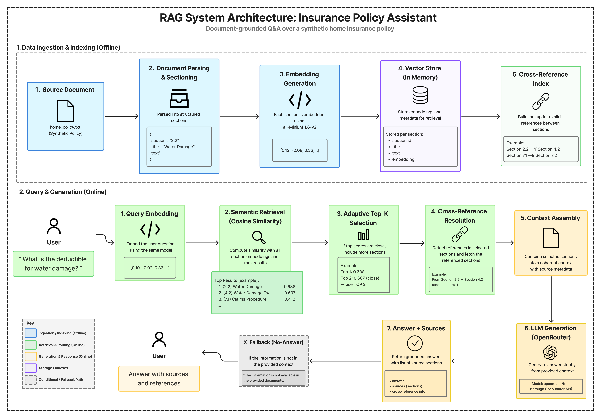

# 🛡️ Insurance Policy RAG Assistant

A lightweight document-based question-answering assistant for a synthetic home insurance policy.

The application uses a manually implemented Retrieval-Augmented Generation (RAG) pipeline to retrieve relevant policy sections and generate grounded answers through an LLM.

The project intentionally avoids RAG frameworks such as LangChain and LlamaIndex in order to expose the core retrieval, ranking, routing, and generation logic directly.

## 🌐 Live Demo

👉 **[Try the application here](https://ayoub-insurance-rag.streamlit.app/)**

The application is deployed using Streamlit Community Cloud.

---

## ✨ Features

- Semantic search over insurance policy sections
- Sentence Transformer embeddings
- Cosine similarity ranking
- Adaptive Top-K retrieval
- Deterministic ambiguity detection
- Cross-reference resolution between policy sections
- Source attribution for generated answers
- No-answer fallback when information is not present
- Conversational Streamlit interface
- Persistent chat history during the user session
- Single LLM request per question to reduce latency and API usage

---

## 🏗️ System Architecture

<p align="center">
  
</p>

<p align="center">
  <em>Architecture of the Insurance Policy RAG Assistant</em>
</p>

The architecture separates the system into two main stages:

- **Offline ingestion and indexing**: document parsing, section-based chunking, embedding generation, and cross-reference indexing.
- **Online retrieval and generation**: query embedding, semantic ranking, adaptive Top-K selection, cross-reference resolution, context assembly, and grounded LLM generation.

---

## 🧠 How It Works

The pipeline is implemented manually without LangChain or LlamaIndex.

```text
Insurance Policy
      ↓
Document Parsing
      ↓
Section-Based Chunking
      ↓
Sentence Transformer Embeddings
      ↓
Cosine Similarity Search
      ↓
Adaptive Top-K Selection
      ↓
Cross-Reference Resolution
      ↓
Relevant Context
      ↓
LLM Generation
      ↓
Answer + Sources
```

### 1. Document Ingestion

The insurance policy is parsed into structured sections containing:

```python
{
    "section": "2.2",
    "title": "Water Damage",
    "text": "..."
}
```

The chunking strategy follows the natural structure of the policy instead of splitting the document using arbitrary character or token windows.

### 2. Embeddings

Each section is converted into a dense vector using:

```text
sentence-transformers/all-MiniLM-L6-v2
```

The section title and content are combined before embedding.

### 3. Semantic Retrieval

The user's question is embedded using the same model.

Cosine similarity is calculated between the question vector and all policy section vectors.

The sections are then ranked from most relevant to least relevant.

### 4. Adaptive Top-K Retrieval

The system initially considers the strongest retrieval result.

If the similarity scores of the highest-ranked sections are close, the retrieval is considered ambiguous and additional sections are included.

For example:

```text
Top-1 score: 0.638
Top-2 score: 0.607

→ Results are close
→ Expand retrieval to Top-2
```

This prevents the system from blindly sending a fixed number of chunks for every question.

### 5. Cross-Reference Resolution

Insurance policies frequently contain references such as:

```text
For exclusions related to water damage, see Section 4.2.
```

The system detects these references using regular expressions and retrieves the referenced section directly.

This avoids relying on semantic similarity to rediscover an explicitly referenced section.

Example:

```text
Section 2.2
      ↓
"See Section 4.2"
      ↓
Direct lookup
      ↓
Section 4.2 added to context
```

### 6. Answer Generation

Only the selected context is sent to the LLM.

The model is instructed to:

- answer only from the provided policy context;
- avoid outside knowledge;
- avoid inventing missing information;
- return a specific fallback when the answer is unavailable.

The current implementation uses OpenRouter for LLM inference.

---

## 💬 Example Questions

You can ask questions such as:

```text
What is the deductible for water damage?
```

```text
What does the policy say about water damage?
```

```text
How long do I have to report a claim?
```

```text
What happens if I make a fraudulent claim?
```

```text
How long is the grace period after a missed premium payment?
```

```text
What is the maximum personal liability coverage?
```

The assistant can also reject questions whose answers are not contained in the policy.

Example:

```text
Does this policy cover medical treatment?
```

Result:

```text
The information is not available in the provided documents.
```

---

## 🗂️ Project Structure

```text
insurance-rag-demo/
│
├── assets/
│   └── architecture.png
│
├── data/
│   └── home_policy.txt
│
├── ingestion.py
├── embeddings.py
├── llm.py
├── app.py
├── requirements.txt
├── README.md
└── .gitignore
```

### `ingestion.py`

Reads the policy and transforms it into structured sections.

### `embeddings.py`

Handles:

- embedding generation;
- cosine similarity;
- semantic ranking;
- adaptive retrieval metadata;
- cross-reference detection and resolution.

### `llm.py`

Handles:

- context preparation;
- adaptive retrieval routing;
- OpenRouter requests;
- grounded answer generation.

### `app.py`

Provides the Streamlit conversational interface and maintains chat history during the session.

---

## 🛠️ Technologies

- Python
- Streamlit
- Sentence Transformers
- Scikit-learn
- NumPy
- OpenRouter API
- Requests
- python-dotenv

Embedding model:

```text
all-MiniLM-L6-v2
```

---

## 🚀 Running Locally

### 1. Clone the repository

```bash
git clone https://github.com/ayouyX/insurance-rag-demo.git
cd insurance-rag-demo
```

### 2. Install dependencies

```bash
pip install -r requirements.txt
```

### 3. Configure environment variables

Create a `.env` file:

```env
OPENROUTER_API_KEY=your_openrouter_api_key
OPENROUTER_MODEL=openrouter/free
```

The `.env` file is excluded from Git through `.gitignore`.

### 4. Start the application

```bash
streamlit run app.py
```

The application will normally be available at:

```text
http://localhost:8501
```

---

## 📄 Dataset

The policy used in this demo is **synthetic** and was created specifically for this project.

It contains sections covering topics such as:

- property damage;
- water damage;
- theft;
- liability;
- claims;
- exclusions;
- valuables;
- emergency assistance;
- premiums;
- fraud;
- cancellation and renewal.

No private or employer data is used.

---

## ⚠️ Current Scope

This project is intentionally kept small to focus on the retrieval architecture.

The current version does not include:

- OCR or PDF ingestion;
- multi-document retrieval;
- persistent conversation storage;
- authentication;
- production-scale vector databases;
- reranking models;
- evaluation pipelines.

Embeddings are currently computed in memory because the demonstration knowledge base is small.

---

## 🎯 Purpose

The goal of this project is not to reproduce a complete production insurance chatbot.

Instead, it demonstrates the main building blocks of a document-grounded assistant while keeping the retrieval process transparent and implemented from scratch:

```text
chunking
→ embeddings
→ ranking
→ routing
→ cross-reference resolution
→ grounded generation
```

This makes it possible to inspect and control the retrieval behavior without hiding the implementation behind a RAG framework.

---

## 👤 Author

**Ayoub Mossati**

Data Science & Artificial Intelligence

[LinkedIn](https://www.linkedin.com/in/ayoub-mossati-a720aa36a/)